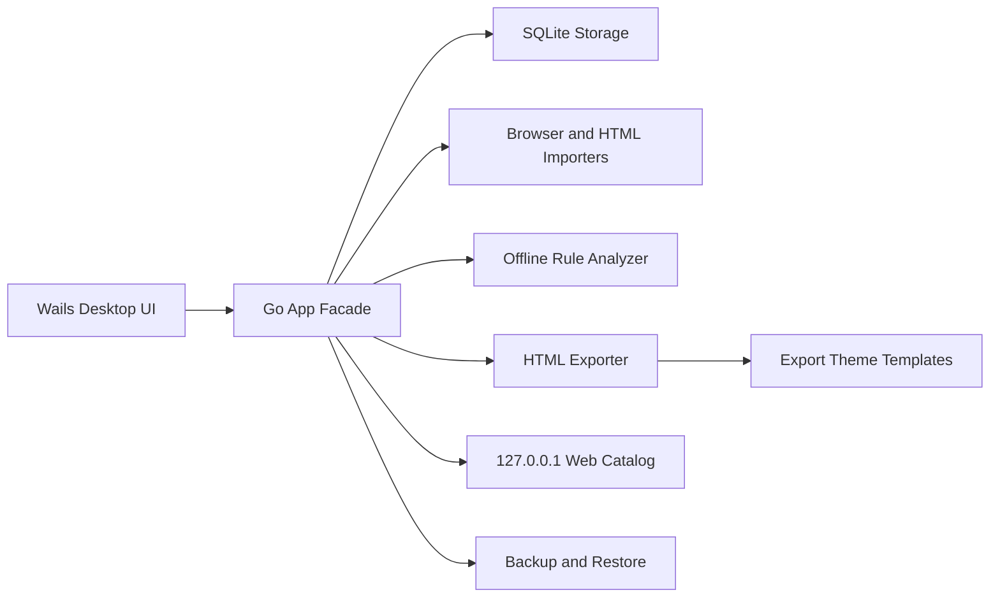

# Architecture Overview

Cola Bookmarks is a local-first desktop application.

## Boundaries

- The Vue frontend only talks to the Wails `App` facade.
- Storage is local SQLite.
- The local Web server is read-only and binds to `127.0.0.1`.
- Theme packages are data and CSS only; JavaScript execution is out of scope.
- AI analysis is offline and rule-based in the current version.

## Privacy Model

Bookmark data, tags, aliases, analysis results, backups, and exports stay local. No telemetry or cloud upload is part of the current architecture.
